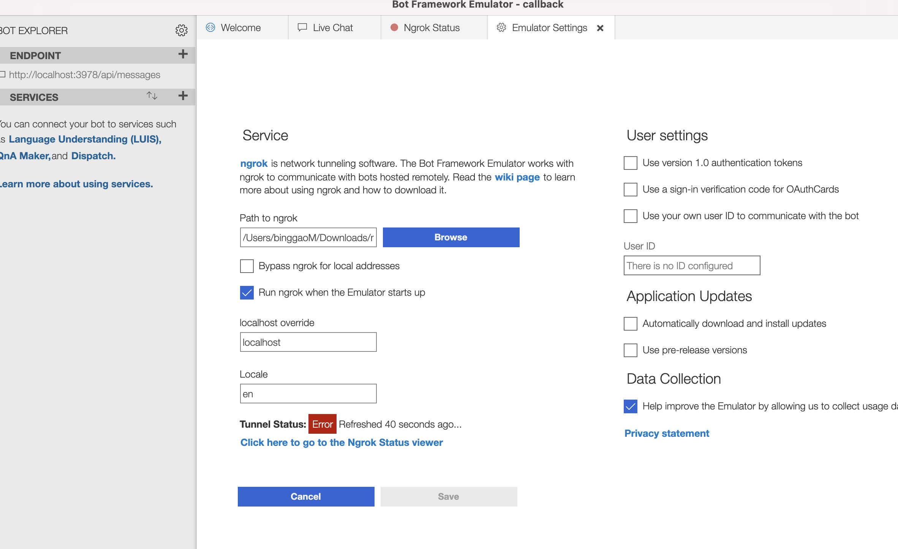

# oas-callback-Bot

## Summary

Bot Framework v4 application.

This bot has been created using [Bot Framework](https://dev.botframework.com), it shows how to create a simple bot that accepts input from the user and echoes it back.

The project is building a chatbot to help OAS user to understand and know their pension information. to be add more when we have a clear requirement in the future

## Build Status

<a href="https://teamcity.dts-stn.com/viewType.html?buildTypeId=OasUnlockBot_DeployBdmDev&guest=1" >

</a>

## Table of Contents

- [oas-callback-Bot](#oas-unblock-bot)
  - [Summary](#summary)
  - [Table of Contents](#table-of-contents)
  - [Prerequisites](#prerequisites)
  - [Technology stack](#technology-stack)
  - [Installation](#installation)
    - [Running the project with docker](#running-the-project-with-docker)
    - [Running the project with npm](#running-the-project-with-npm)
  - [Database and storage](#database-and-storage)
  - [Testing](#testing)
    - [Unit testing](#unit-testing)
    - [Integration Testing](#integration-testing)
  - [Testing the bot using Bot Framework Emulator](#testing-the-bot-using-bot-framework-emulator)
    - [Connect to the bot using Bot Framework Emulator](#connect-to-the-bot-using-bot-framework-emulator)
  - [Interacting with the bot](#interacting-with-the-bot)
  - [Deploy the bot to Azure](#deploy-the-bot-to-azure)
  - [Pipeline Integration](#pipeline-integration)
  - [Further reading](#further-reading)
  - [Config Changelog](#config-changelog)

## Prerequisites

- [Node.js](https://nodejs.org) version 15.0 or higher

  ```bash
  # determine node version
  node --version
  ```

- [npm](https://www.npmjs.com/)
- [docker](https://docs.docker.com/get-docker/)
- [docker-compose](https://docs.docker.com/compose/install/)
- [bot-framework](https://dev.botframework.com/)

## Technology stack

- [restify](http://restify.com/) - Backend framework
- [TypeScript](https://www.typescriptlang.org/) - Backend programming language
- [Azure Cloud](https://www.azure.com) - Cloud provider
- [Data storage](TBD) - TBD

## Installation

Follow these steps to get started.

- Clone the repository

```bash
git clone https://github.com/DTS-STN/oas-callback-bot
```

or

```back
git clone git@github.com:DTS-STN/oas-callback-bot.git
```

### Running the project with docker

1. Add a `.env.local` file to `.config`

- `cp .config/.env.example .config/.env.local`
- Update `.config/.env.local` with variables provided by existing dev.

To run the server

```bash
make run-local-development
```

To tear down your environment:

```bash
make close-local
```

Workspaces:

- Server - `make local-server-workspace`

### Running the project with npm

- Add a `.env` file to the directory root
- `cp config/.env.example /.env`
- Update `/.env` with variables provided by existing dev.
- Install modules

  ```bash
  npm install
  ```

- Start the bot

  ```bash
  npm run start:dev
  ```

## Database and storage

- TBD

## Testing

### Unit testing

- will using bot framework testing client to do the unit test. for more information please visit [bot doc](https://docs.microsoft.com/en-us/azure/bot-service/unit-test-bots?view=azure-bot-service-4.0&tabs=csharp)

### Integration Testing

- TBD

## Testing the bot using Bot Framework Emulator

[Bot Framework Emulator](https://github.com/microsoft/botframework-emulator) is a desktop application that allows bot developers to test and debug their bots on localhost or running remotely through a tunnel.

- Install the latest Bot Framework Emulator from [here](https://github.com/Microsoft/BotFramework-Emulator/releases)

### Connect to the bot using Bot Framework Emulator

- Launch Bot Framework Emulator
- File -> Open Bot
- Enter a Bot URL of `http://localhost:3978/api/messages`
- Enter a Dev Bot URL `https://dts-oas-callback-bot-dev.bdm-dev.dts-stn.com/api/messages`
- if you are using docker container or connect to dev env from your local laptop, please download ngrok and config as below 
- otherwise do not need this step
- Enter MicrosoftAppId and MicrosoftAppPassword from your .env file

## Interacting with the bot

Enter text in the emulator. The text will be echoed back by the bot.

## Deploy the bot to Azure

To learn more about deploying a bot to Azure, see [Deploy your bot to Azure](https://aka.ms/azuredeployment) for a complete list of deployment instructions.

## Pipeline Integration

This application leverages GitHub actions and TeamCity Pipelines for performing pre-merge regression testing.
On PR creation or update, the Pipelines will run the entire API test collection, as well as the integration tests.
The github action will run testing and build docker container for application. the TeamCity will using helm tool that deploy the container image to k8s cluster.

## Further reading

- [Bot Framework Documentation](https://docs.botframework.com)
- [Bot Basics](https://docs.microsoft.com/azure/bot-service/bot-builder-basics?view=azure-bot-service-4.0)
- [Activity processing](https://docs.microsoft.com/en-us/azure/bot-service/bot-builder-concept-activity-processing?view=azure-bot-service-4.0)
- [Azure Bot Service Introduction](https://docs.microsoft.com/azure/bot-service/bot-service-overview-introduction?view=azure-bot-service-4.0)
- [Azure Bot Service Documentation](https://docs.microsoft.com/azure/bot-service/?view=azure-bot-service-4.0)
- [Azure CLI](https://docs.microsoft.com/cli/azure/?view=azure-cli-latest)
- [Azure Portal](https://portal.azure.com)
- [Channels and Bot Connector Service](https://docs.microsoft.com/en-us/azure/bot-service/bot-concepts?view=azure-bot-service-4.0)
- [Restify](https://www.npmjs.com/package/restify)
- [dotenv](https://www.npmjs.com/package/dotenv)

## Config Changelog

- None
